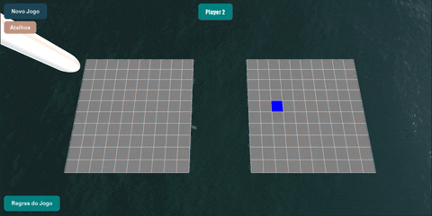
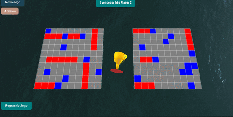

# WebGL Battleship

A 3D Battleship game built from scratch in the browser with [three.js](https://threejs.org/), no game engine, no backend. Built for the Computer Graphics course of my BSc in Computer Engineering at UTAD.

<p align="center">
  
  
</p>

## 🎯 About

Two players place their ships on their own 10x10 board, floating on a rendered ocean, then take turns attacking each other's board until one fleet is destroyed. Everything in the scene, the boards, the ocean, the sky, the torpedo, the victory trophy, is built or imported and lit directly with three.js primitives and shaders, with no 2D UI framework involved.

## ✨ Features

- **Real-time ocean and sky**, using three.js's `Water` and `Sky` shader objects, animated as the game runs.
- **Two camera modes**: an orthographic top-down camera for the ship-placement phase, and a perspective camera for the attack phase, switched with `Space`.
- **Interactive ship placement** using three.js's `TransformControls`, drag each ship into position on your board.
- **Custom-built 3D objects**: a torpedo (combining capsule, cylinder and plane geometries) that drops from the sky on every attack, and a trophy (lathe, cylinder, box and torus geometries) that rises and spins for the winner.
- **Lighting controls**: toggle a `SpotLight` (`L`) and an `AmbientLight` (`M`) independently to see how each affects the scene.
- **ACES tone mapping** (`N`), for a more realistic range of light and color on the water.
- Turn indicator, placement validation, and in-game shortcuts/rules menus.

## 🕹️ How to play

1. Each player places their ships on their own board (orthographic view). Press `Enter` once all ships are placed to lock them in.
2. The view switches to the perspective camera for the attack phase. Click a square on the opponent's board to attack it, hits are marked red, misses blue.
3. Hit a ship and you attack again; miss and it's the other player's turn.
4. First to sink the opponent's whole fleet wins, cue the trophy.

| Key | Action |
|---|---|
| `Space` | Switch between orthographic and perspective camera |
| `Enter` | Confirm ship placement |
| `L` | Toggle spotlight |
| `M` | Toggle ambient light |
| `N` | Toggle ACES tone mapping |
| Left click | Attack a square (attack phase) |

## 🛠️ Tech Stack

<p align="center">
  
  
  
  
</p>

## ▶️ Running it

Browsers block ES module imports and texture loading over `file://`, so this needs a local static server, not just opening `index.html` directly.

1. **Get the main ship model.** To keep this repository lightweight, the largest ship model (`Barco4`, used for both players' main vessel) isn't committed here. Download it from [Boat UUU on Sketchfab](https://sketchfab.com/3d-models/boat-uuu-55121d0f05a24a42ba55d48935fe6529) (glTF format) and place its contents at `Objetos/Barco4/` (so you end up with `Objetos/Barco4/scene.gltf` and `Objetos/Barco4/scene.bin`).
2. From this folder, run a static server, for example:
   ```bash
   python -m http.server 8000
   ```
3. Open `http://localhost:8000` in a browser.

## 🙏 Credits

Three.js (MIT License) is loaded via CDN, no local copy needed.

The ship models are free, CC-BY-4.0 licensed assets from Sketchfab:

- "Boat UUU" by [gogiart](https://sketchfab.com/agt14032013) — [source](https://sketchfab.com/3d-models/boat-uuu-55121d0f05a24a42ba55d48935fe6529)
- "Tow Boat" by [BoatUS Foundation](https://sketchfab.com/boatusfoundation) — [source](https://sketchfab.com/3d-models/tow-boat-86939cf48b914951aa3c6ed2bc8bb446)
- "South Korean Destroyer Chung Mu" by [shangus930](https://sketchfab.com/shangus930) — [source](https://sketchfab.com/3d-models/south-korean-destroyer-chung-mu-9cf33c04f8d244638806b8dc37de098f)
- "U-Boat" by [Ashkelon](https://sketchfab.com/Ashkelon) — [source](https://sketchfab.com/3d-models/u-boat-eae3d9b194f542f29cd80b6a1e9504a6)

All licensed under [CC-BY-4.0](http://creativecommons.org/licenses/by/4.0/).

## 👤 About

Part of my portfolio. See my [GitHub profile](https://github.com/linho22w) for more projects in AI/ML and backend development.
